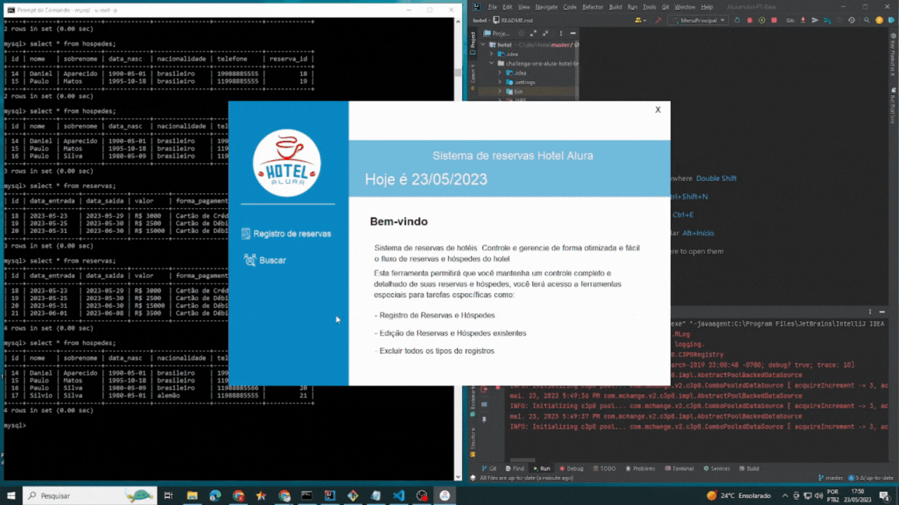

# Challenge ONE | Java | Back-end | Hotel Alura

     

---

#### 🔹 Visite a página do desafio clicando aqui! [Link do Challenge](https://www.alura.com.br/challenges/oracle-one-back-end/hotelalura) 📃 
 

## 🖥️ Tecnologias Utilizadas:

- Java 17
- IntellijIDEA
- MySql
- Biblioteca JCalendar
 

---
## ⚠️ Importante! ⚠️

☕ 
#### Para este desafio, concentrei-me na parte lógica e de conexão com o Banco de Dados. 
 

---

## 🔍 Analisando o repositório!

### Usei o repositório base para o desenvolvimento do backend. Voce pode acessá-lo <a href="https://github.com/alura-challenges/challenge-one-alura-hotel-br">aqui</a>.
 

## 📅 JCalendar

Após importar para o seu editor, é necessário instalar a biblioteca <strong>JCalendar</strong>, caso contrário o projeto apresentará um erro e não será possível abrir a janela de <strong>Reservas</strong>.  

Para instalar, você precisa baixar o pacote através desse link:
🔹 [Link para o JCalendar](https://toedter.com/jcalendar/)

     

A próxima etapa será extrair os arquivos da pasta <strong>lib</strong> para uma pasta local e importar os arquivos para o Eclipse. 

          

Arquivos da pasta <strong>lib</strong>:

     

Clique com o botão direito do mouse sobre o projeto localizado no <strong>Package Explorer</strong> e escolha a opção <em>Build Path</em> e <em>Configure Build Path</em>.

     

O projeto estará com um aviso de erro, indicando que não existe a rota da biblioteca em seu computador. Clique em <em>Libraries</em>, em seguida em <em>Classpath</em>
selecione o arquivo do JCalendar, escolha a opção <em>Remove</em> e <em>Apply and Close</em>.

     

Para importar o <strong>Jcalendar</strong> do seu computador, após ter "extraído" os arquivos do download, clique em <em>Classpath</em> e depois em <em>Add External JARS</em> adicione um a um e clique em <em>Apply and Close</em>.

     

Assim, o projeto deve conter os seguintes arquivos após as importações:

     

## 🚧 Projeto

#### Ao clonar ou baixar o projeto base e ter o JCalendar instalado, você terá esta apresentação ao executar o projeto:

     

### Tela de Login e Cadastro
 

### Tela de busca e update

### Excluindo dados

## 📊 Banco de Dados

### Como importar o MySqlConnector no projeto?

É o mesmo caminho descrito para a importação do <strong>JCalendar</strong>, clicar com o botão direito do mouse em cima do projeto, <em>Build Path</em>, <em>Configure Build Path</em>, <em>Libraries</em>, <em>Add External JARs</em>. Para encontar o caminho desse aquivo <strong>.jar</strong>, vá até o disco rígido do seu computador e entre na pasta <em>Arquivos de Programas (x86)</em>.

- Arquivos de Programas (x86):

     

- MySQL

     

- Connector J 8.0:

     

- My SQL Connector Java:

     

### Modelagem das tabelas:

Para este desafio foi proposto duas tabelas: <strong>Reservas</strong> e <strong>Hóspedes</strong>. A tabela de hóspedes deve conter a chave estrangeiro <em>(foreign key)</em> <strong>idReserva</strong>.

     
    

<h3> Criando a Connection</h3>

Utilizei como base a aula "Configurando o conector" do curso "Java e JDBC: trabalhando com um banco de dados"

<h1>MySQL na linha de comando</h1>

Utilizei alguns comandos no cmd do windows

<h3> Logando no MySql:</h3>
<pre>
    <code>
    -u {meu-usuario} -p
    </code>
</pre>

Criei as tabelas "reservas" e "hospedes" com o seguinte comando:

<pre>
    <code>
    create table reservas (
        id INT AUTO_INCREMENT PRIMARY KEY, 
        data_entrada DATE, 
        data_saida DATE, 
        valor VARCHAR(255), 
        forma_pagamento VARCHAR(255));
    </code>
</pre>

<pre>
    <code>
    create table hospedes (
        id INT AUTO_INCREMENT PRIMARY KEY, 
        nome VARCHAR(255), 
        sobrenome VARCHAR(255), 
        data_nasc DATE, 
        nacionalidade VARCHAR(255), 
        telefone VARCHAR (15), 
        reserva_id INT, 
        FOREIGN KEY (reserva_id) REFERENCES reservas(id));
    </code>
</pre>

 Para visualizar a tabela, é com o seguinte comando:

<pre>
    <code>select * from hospedes </code>
</pre>
    
## 📬 Entrega

### Como incluir meu projeto com a "#" do desafio?

1) Tenha o <strong>Fork</strong> do projeto em seu repositório no Github.
2) Utilize o tópico **#challengeonealurahotelbr4**. Vá na aba esquerda do seu projeto na seção <em>About</em> e clique na engrenagem de configuração selecione o campo **topics** e insira a etiqueta **challengeonealurahotelbr4**.

📧 lincolndeveloper@outlook.com
